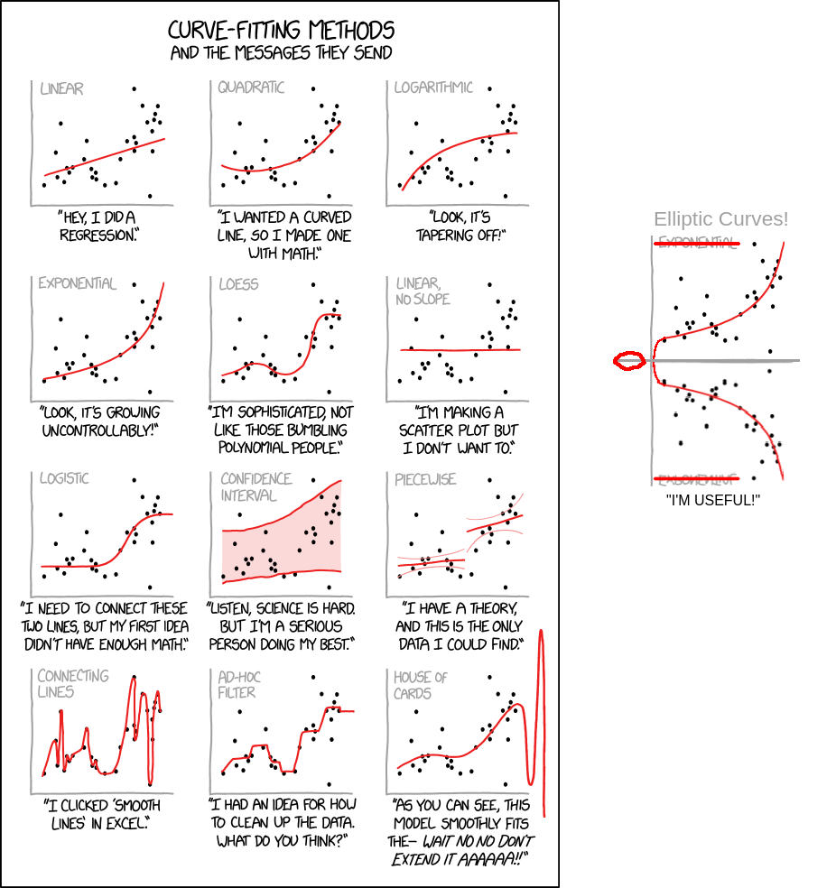

Curve Trees [@cryptoeprint:2022/756] are a cryptographic data structure used to accumulate values and prove if values are members of the accumulated set. They are to be used in Monero's FCMP (Full Chain Membership Proofs)[^11] -- the future replacement of ring signatures -- and for a good reason:

|            | d-CLSAG [@cryptoeprint:2019/654] (d=1) | Curve Trees |
|------------|----------------------------------------|-------------|
| set size   | 90                                     | $2^{40}$    |
| proof size | 2.9KiB                                 | 2.9KiB      |

Furthermore, they eliminate the need for Monero's 10 block lock rule, as they don't leak decoys[^9]. Currently, Monero uses the ring signature's key image to prevent double spends of the same 'enote'[^8]; Seraphis separated these into a proof of membership and a proof of authorization, letting 'pure' membership proof schemes -- such as Curve Trees -- to be used.

## Why should I care?

- You don't want to read the paper, but want to read about curve trees,
- You think this is cool,
- ????  <-- That's the best part!
- Profit.

Because you clicked on whatever link brought you to a page about Curve Trees; obviously, you're interested. Anyway, who doesn't want to impress their friends with crypto knowledge at the next party? "Curve Trees are a multi-level marketi- set membership scheme, that lets you be your own boss! You just need to invest _a bit_. Commit here, here here and here." Instant party hit.

## Assumed knowledge

You must have basic math knowledge about fields and groups[@cseedu:brubaker/152groups]. Elliptic curves can be treated as an algebraic construct that is defined over a field called the base field. You do need to assume, even as merely a black box, that points on elliptic curves form a cyclic (and thus also an abelian, better known as a commutative) group, with the identity being the "point at infinity" $\mathcal{O}$. For an introduction, look at [these slides](https://www.math.brown.edu/johsilve/Presentations/WyomingEllipticCurve.pdf). This post is not self contained, but I keep quite a comprehensive [bibliography](#references) at the end. Note the use of $\langle a, b \rangle$ to represent the inner product[^7].



The Curve Trees paper assumes the hardness of the Discrete Log Problem (DLP). It basically means that it is hard to find $n$ from the knowledge of $G$ and $P$ with the relation $[n]G = \underbrace{G + \ldots + G}_{\text{n times}} = P$.

Many zero-knowledge proofs use what's called C&P (Commit and Prove) schemes: they commit to a value--something that lets them 'represent' the value without revealing it--and then prove with that commitment some knowledge.

Commitments are functions on vectors which:

1. bind to the committed value: it is computationally hard to commit to a value, and then find another opening (value) that 'encodes' to the same commitment; and

2. also are perfectly or computationally hiding.

Pedersen commitments are commonly used in ZK proofs and structures: they are homomorphic[^6], simple and lightweight -- making them an easy choice. They are defined as $Com(v, s) = \sum [v_i]G_i + [s]H = \langle v, G \rangle + [s]H \in E[\mathbb{F}_q]$, where $s$ is the blinding factor and $v$ is the opening, or the vector we are committing to. $G_i,H \in E[\mathbb{F}_q]$, $E[\mathbb{F}_q]$ being an elliptic curve on the field $\mathbb{F}_q$. You'd notice I'm using $\mathbb{F}_q$ and not the usual $\mathbb{F}_p$ -- that's on purpose. :)

Pedersen commitments are great for yet another reason: they are re-randomizable. So if you have a tree, 1. you can re-randomize its entries so that it cannot be linked to the other tree, and 2. it's really easy (computationally) to do so.
$Rerand(Com(v, s), r) = Com(v, s) + [r]H = \langle v, G \rangle \text{ } + [s + r]H = Com(v, s + r)$

In curve trees, Pedersen commitments are used as a compressor function at every level of the tree. Think Merkle Trees, but using Pedersen commitments as a hash and $2 \cdot \text{degree}$ field elements -- $(x, y)$[^3] of $\text{degree}$ points as $v$. You would notice that, because the elliptic curve group is cyclic, scalars -- the ones we use for multiplication operations on the elliptic curve -- are essentially modulo the order of the group, or, in its scalar field[^1]. Say $\mathbb{F}_p$ is $E[\mathbb{F}_q]$'s scalar field. $x,y \in \mathbb{F}_q$, but they also need to be in $\mathbb{F}_p$. Naturally[^2], we ask why can't $p = q$, but that is not possible, or at least not possible to do securely [@cryptoeprint:2014/595 section 3.1; @cryptostackexchange:106774].

This 'type mismatch' has been seen before in zk proofs: earlier methods, such as  and some ETH zero knowledge contracts, emulate(d) field arithmetic on one field with operations on another for the exact same reason; committing produces results in the base field, and proving needs to work on the scalar field [@blogicme:canweavoidcycles; @blogpersonlabs:efficientecdsa] [^10]. That's called "wrong field arithmetic" or "non-native arithmetic", and is too slow to be practical: circuits using it can be 100 to 200 times larger[@slides:deepdiveonhalo2 page 38]. They found that we could, however, define that two elliptic curves have complementing cardinalities and orders, as in, one's scalar field being the base field of the other. meaning every odd and even layers will be points of $E_{odd}$ and $E_{even}$ respectively, using the pedersen commitment as an adaptor. that would work, but do such curves exist?

![Elliptic curve Cycles [@springer:asurveyproofsys fig. 1]](../resources/curve-trees1-2.png)

Surprisingly, yes!

(A bit) More formally, Curve Trees are the algebraic structure $(\ell, E_{even}, E_{odd})$, where $\ell$ is the branching factor of the tree, with the $\ell$ children at each layer compressed by their parent with the alternating compression functions $f_{E_{even}}: \quad E_{odd}^{\ell} \mapsto E_{even}$ and $f_{E_{odd}}: \quad E_{even}^{\ell} \mapsto E_{odd}$ being Pedersen commitments as explained earlier. The tree is defined recursively, where leaves make up the set of values we can commit to. Those are compressed by the aforementioned compression function, until the root is reached.

![Curve Trees paper [@cryptoeprint:2022/756] fig. 3; The orange path is the path to the leaf.](../resources/curve-trees1-3.png)

Let's return to why we even wanted this construction: we wanted a tree.

Just kidding, we wanted to prove that a value we selected is in some set. So how can we do that here? We can publish the path to the value, but that wouldn't be zero-knowledge. We need something to prove we did the procedure correctly! Choosing Pedersen commitments was a fortunate choice in this regard, as many efficient proof systems exist for them, such as Bulletproofs[@cryptoeprint:2017/1066] (which I'll cover in the next post), many SNARKs/STARKs, PLONK, etc. Those systems allow you to prove that we built the tree correctly, by constraining the commitment to be generated by its children, and the path element be one of them, but re-ranzomized. In the paper, Bulletproofs are used to generate a proof for these re-randomized commitments, and because we use different curves for odd and even layers, we generate two proofs: one for the odd layers and the other for the even ones.


Bulletproofs are incredibly interesting and are a centric component for this scheme/structure. The next blog is going to be concerned with how they work and the generalization the authors provided to enable this structure. Thanks for reading!

# References

<div id="refs"></div>

# Appendix A - Curve-Tower Cycles

Many protocols and implementations use Curve25519, or more specifically, its Twisted Edwards form [@bernstein2012highspeed]. But secure curve cycles with it are impossible because the order of its (sub)group (generated by its generator point $G$) is not prime, meaning $[n]G = \mathcal{O}$ where $n$ isn't prime. Notice that if we could find a 2-cycle with curve $\#E[\mathbb{F_p}] = q$ and $\#E[\mathbb{F_q}] = p$ and $p = 2^{255} - 19$[^4], points on Curve25519 could be mapped to points on $E[\mathbb{F_q}]$, and 'enter' the cycle. This is well defined because they have the same number of points, meaning they can be mapped between each other.

```
   -- Ep --
 /          \
|            ^
v            |
 \          /
   -- Eq --
      ^
      |
  Curve25519
```

tevador called this arrangement a "tower-cycle". For more details about the generation of such curves, tevador posted a gist on GitHub [@githubgist:curve-tower-cycle].

![Finding curves is fun[^5]! But... Bread is probably tastier. (xkcd 2407)](https://imgs.xkcd.com/comics/depth_and_breadth.png)

[^1]: This field's cardinality is the same as the order of the elliptic curve's subgroup generated by the point. In simpler words, its size is the same as the number of points on the elliptic curve that we can generate using that point $G$. It is a field if and only if $\#E[\mathbb{F}]$ is prime (and thus the subgroup is actually the whole group), which is necessary for a curve cycle (defined later). That is not the case for curves with cofactor $h > 1$. See [Appendix A](#appendix-a-curve-tower-cycles). For more information about subgroups you can read [here](https://crypto.stackexchange.com/questions/95752/how-to-decide-if-a-point-on-a-elliptic-curve-belongs-to-a-group-generated-by-a-g).

[^2]: Using transformations on the field doesn't work; modulo will introduce bias to certain points, for example.

[^3]: The paper assumes you can represent the point at infinity, the identity of the elliptic curve group, as (x, y) coordinates (in ${\mathbb{F}_q}^2$), which is true for the pasta curves[@electriccoin:pastahalo2].

[^4]: Base field characteristic of Curve25519.

[^5]: Those aren't the right search algorithms/constraints, but you get the point.

[^6]: Homomorphic means that there exists a homomorphism, a function from one group to another s.t. $H(a) \otimes H(b) = H(a \oplus b)$. You can see why Pedersen commitments are homomorphic here: $Com(v_1, s_1) + Com(v_2, s_2) = \langle v_1, G \rangle + \langle v_2, G \rangle$ $\text{ } + [s_1]H + [s_2]H = \langle v_1 + v_2, G \rangle + [s_1 + s_2]H$ $\text{ } = Com(v_1 + v_2, s_1 + s_2)$. Note that $+$ means different things here: at first it's point addition on the elliptic curve and then it is vector addition.

[^7]: The inner product here is the dot product: take two vectors $v_1, v_2 \in \mathbb{G}^n$ $\langle v_1, v_2 \rangle = \sum_{i=1}^n v_{1_i} \cdot v_{2_i}$. Inner product with an elliptic curve group would take $v \in \mathbb{G}^n, \vec{G} \in \mathbb{E}[\mathbb{F}_q]$ and compute $\sum_{i=1}^n [v_i]\vec{G}_i$.

[^8]: An enote is an output of a transaction, and can be spent once. Change can be saved by having two outputs: one for the actual recipient, and one for the change.

[^9]: Ring signatures use decoys to obstruct peopole from knowing who the sender is. However, due to how PoW works, recents committed blocks can be reordered or removed from the chain, thus comprimising privacy. Basically, an attacker can spam the network with double spends and force a reorg, and if other users use their outputs as decoys, the attacker can deanonymize them. Koe talked about this more [here](https://github.com/monero-project/research-lab/issues/95).

[^10]: Also, "Proof composition involves verifying proofs that themselves verify other proofs, requiring \"nesting\" of operations in different fields" [@blogicme:costofrecursion], and thus inherently needs to operate on wrong fields.

[^11]: This was just a sidenote -- you don't have to understand nor know about FCMPs.
